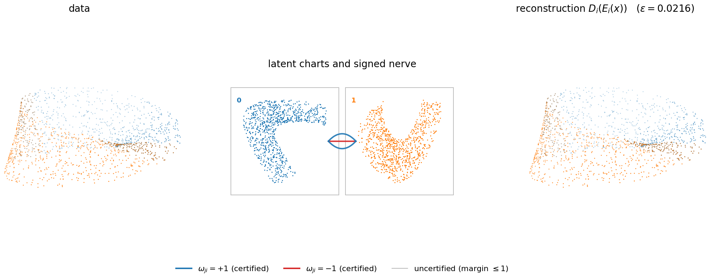

# atlasae

**Autoencoder atlases: learned charts, tangent bundles, and Stiefel–Whitney
classes from data.**

`atlasae` treats a collection of locally trained autoencoders as an *atlas* on
a data manifold. The transition maps between latent coordinates are
differentiated, the signs of their Jacobian determinants form a Z/2 Čech
cocycle, and orientability is decided by two-colouring the signed nerve of the
cover — with a *sample-computable certificate* that says when the computed
answer can be trusted.

Companion package to the paper

> E. Paluzo-Hidalgo and Y. Ike, *Learning Tangent Bundles and Characteristic
> Classes with Autoencoder Atlases*, 2026.

The paper repository (experiments, LaTeX sources, per-trial results) is at
<https://github.com/EduPH/learningtangentbundle>; this repository contains the
package alone.

## Install

```bash
pip install -e .            # core (numpy/scipy/sklearn/matplotlib/tensorflow)
pip install -e ".[tda]"     # + dreimac/ripser/persim for cover constructions
```

## What it does

- **`AtlasAutoencoder`** — one small autoencoder per neighbourhood of a cover;
  charts train independently on reconstruction (plus optional Jacobian and
  differential regularisers).
- **`fast_fit` / `train_until_certified`** — compiled trainer, and a
  certificate-aware protocol that stops early once the certificate holds.
- **`check_orientability`** — the sign cocycle of the transition Jacobians,
  cocycle verification at the sample points, and the coboundary
  (two-colouring) test.
- **`sign_constancy_report` / `certify_verdict`** — the sampling-density
  margin that proves the signs constant *between* the sample points, and the
  certified verdict built on it (a non-orientable verdict needs one certified
  odd cycle; an orientable verdict needs every overlap component certified).
- **`compare_eta` / `pca_tangent_frames`** — direct measurement of the
  tangent-restricted differential error entering the stability theory.
- **`save_atlas` / `load_atlas`** — persist trained atlases and reload them
  bit-identically.
- **`plot_atlas` / `plot_chart_transitions`** — the figure the method
  deserves: each chart's latent coordinates in its own cell, one line per
  overlap component joining the cells it relates, coloured by the sign of
  `det dT_ji`.
- Cover constructions (landmark, geodesic, good covers of standard manifolds).

## Quick start

```python
import numpy as np
from atlasae import (AtlasAutoencoder, fast_fit, check_orientability,
                     pca_tangent_frames, compare_eta, tetrahedral_cover_S2)

# a point cloud on the 2-sphere, covered by four caps
pts = np.random.randn(1000, 3); pts /= np.linalg.norm(pts, axis=1, keepdims=True)
assign = tetrahedral_cover_S2(epsilon=0.3).get_assignments(pts)

system = AtlasAutoencoder(data=pts, n_charts=4, subset_assignments=assign,
                          latent_dim=2, hidden_dims=[32, 16])
fast_fit(system, epochs=2000, lambda_jac=0.01, lambda_diff=0.01)

frames = pca_tangent_frames(pts, d=2, k=25)
eta = compare_eta(system, pts, assign, frames_pca=frames)   # theorem hypotheses
result = check_orientability(system, pts, assign, eps_cluster=1.0, min_points=5)
print(eta['eta_pca'], result['is_orientable'])

from atlasae import plot_atlas                  # and look at what you trained
plot_atlas(system).savefig("s2_atlas.png", dpi=200, bbox_inches="tight")
```

See `examples/quickstart.py` for the same script ready to run.

A note on `min_points`: overlap components with fewer sample points are
discarded as boundary noise. Discarding can only bias the verdict toward
*orientable* (deleting nerve edges destroys odd cycles but never creates
them), so keep it small — the paper uses and recommends `min_points=5` and
documents what goes wrong at larger values.

## Seeing the atlas

```python
from atlasae import sign_constancy_report, plot_atlas

report = sign_constancy_report(system)          # the expensive part
fig = plot_atlas(system, rows=report["rows"])   # data | charts + nerve | recon
fig.savefig("atlas.png", dpi=200, bbox_inches="tight")
```



*The trained two-chart Möbius atlas of the paper. Left, the sample coloured by
chart; right, its reconstruction, drawn to the same scale and reporting
`ε = 0.022`. Middle, the two latent charts: their overlap falls into three
components, and one of them (red) reverses orientation while the other two
(blue) preserve it. No assignment of ±1 to the two charts can match all three
signs at once — that failure is the non-orientability, and it is read straight
off the picture.*

The outer panels share one projection, one viewing angle and one set of axis
limits, so a faithful reconstruction overlays the data and a poor one visibly
departs from it; the panel title reports the atlas's sup reconstruction error
`ε` so the comparison can be read off rather than eyeballed.

Blue is `+1` (orientation preserving), red is `-1` (reversing), dashed orange
means both signs were seen on one component — a diagnostic, not a verdict.
Edges whose sign is *certified* constant between the sample points are solid;
uncertified ones are thin and pale, so the picture separates what is proved
from what is merely observed. Above twelve charts the nerve is drawn as a sign
matrix instead of a hairball.

The signs come from `sign_constancy_report`, the same computation the
certificate uses, so the figure and the verdict can never disagree. Pass
`rows=` to reuse a report; omit it and one is computed for you.

`examples/plot_mobius_atlas.py` trains a two-chart Möbius atlas from scratch
and produces this figure end to end, printing the sign and margin of every
overlap component as it goes. The number of components depends on the sample,
but the pattern does not: both signs always appear between the same two
charts, which is precisely why no consistent orientation exists.

## Citation

If you use this package, please cite the paper above; citation metadata for
the software itself is in [`CITATION.cff`](CITATION.cff).

## License

MIT — see [`LICENSE`](LICENSE).
